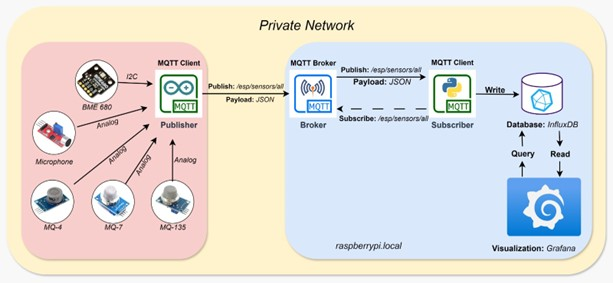

# IoT Architecture Based on Docker for Integrated Environmental Quality Monitoring
Arduino Nano ESP32 → MQTT → Mosquitto → Python Subscriber → InfluxDB → Grafana

## Overview
This project implements a complete end-to-end IoT data pipeline for sensor monitoring.  
An Arduino Nano ESP32 device reads environmental data (temperature, humidity, gas levels, etc.) and publishes the measurements via MQTT.  
A Python MQTT subscriber processes the incoming messages and writes them to an InfluxDB time-series database.  
Grafana is used for visualization and dashboards.
The entire backend (Mosquitto, InfluxDB, Grafana) runs using Docker Compose.

---

## System Architecture


---

## Features

### Arduino Nano ESP32

- Reads environmental data:
  - MQ135 (Air quality)
  - MQ7 (CO)
  - MQ4 (CH4)
  - BME680 (IAQ, Temp, Humidity, Pressure, VOC)
  - Electret microphone (SPL dB)
- Publishes JSON messages via MQTT
- Automatic reconnection to WiFi + Broker
- Built-in calibration routines 

### Backend

- Mosquitto MQTT broker
- Python subscriber using paho-mqtt + Pydantic validation
- InfluxDB 2.7 with buckets/org/token initialization
- Grafana dashboards
- Preconfigured volumes for persistence
- One-command deployment via docker compose
---
## Project Structure
```text
IoT-Environmental-Monitoring-System/
│
├── docker-compose.yml          # Compose file for InfluxDB, Grafana, Mosquitto
├── start.sh                    # Script to start backend + subscriber
├── stop.sh                     # Script to stop backend services
├── architecture.jpg            # Diagram of system architecture
│
├── MQQT_publisher/
│   └── ESP32_mqtt_publisher.ino          # Arduino Nano ESP32 firmware
│
├── MQTT_subscriber/
│   ├── mqtt_subscriber.py      # Main Python MQTT subscriber
│   ├── mqtt_subscriber_config.ini  # MQTT subscriber config
│   ├── sensor_data_writer.py   # Writes validated sensor data to InfluxDB
│   ├── schemas.py              # Pydantic models for sensor data
│   └── requirements.txt        # Python dependencies
│
├── mosquitto/
│   ├── config/                 # Mosquitto configuration files
│   ├── data/                   # Persistent MQTT data
│   └── log/                    # MQTT broker logs
│
└── grafana/
    └── config/                 # Grafana configuration 

```
---
## Installation & Setup

### 1. Clone the repository
```bash
git clone https://github.com/FloricaDolca/IoT-Environmental-Monitoring-System.git
cd IoT-Environmental-Monitoring-System
```
### 2️⃣ Create your `.env` file
Create a `.env` file in the root of the project with your own credentials and configuration variables. Example variables you need to set:

- InfluxDB username, password, token, org, bucket  
- Mosquitto broker settings  
- Grafana admin password  
- Ports for services

### 3. Start backend (MQTT + InfluxDB + Grafana)
```bash
docker compose up -d
```
Services run on:
| Service            | URL                                            |
| ------------------ | ---------------------------------------------- |
| **Grafana**        | [http://localhost:3000](http://localhost:3000) |
| **InfluxDB UI**    | [http://localhost:8086](http://localhost:8086) |
| **Mosquitto MQTT** | mqtt://localhost:1883                          |

### 4. Arduino Nano ESP32 Setup
- In the ESP32 sketch:
- Set WiFi SSID & password
- Set MQTT broker (raspberrypi.local or device IP)
- Upload the code using Arduino IDE

### 5. Run Python MQTT subscriber
```bash
python -m venv venv
source venv/bin/activate   # or venv\Scripts\activate on Windows
pip install -r requirements.txt
python subscriber.py
```
---
## Grafana Dashboards
Create a new dashboard and add:
- Panel for microphone
- Panel for MQ_sensors
- Panel for BME680_data
- Panel for BME680_status
---

## Technologies Used
- Arduino Nano ESP32
- MQTT (Mosquitto)
- Python (Paho MQTT, Pydantic, InfluxDB client)
- InfluxDB 2.x
- Grafana
- Docker & Docker Compose
